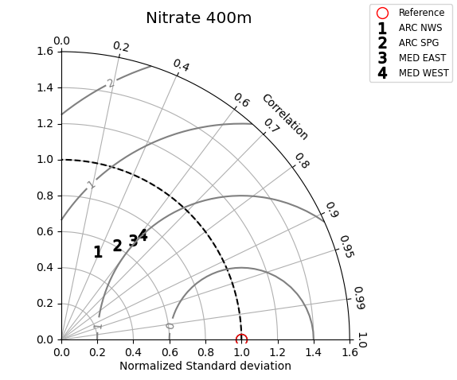

# PU_BGC_diagram
Set of python scripts for plotting diagrams for PU_BGC paper

### Metrices for PU_BGC model ensemble

- Period: 5 years (e.g., 2017-2021 for ARC MFC)
- Model:
   - MFC BGC with data assimilation
   - MFC BGC without data assimilation (control experiment)
- Model subdomains:
   - ARC MFC Norwegian Sea
   - ARC MFC Greenland Sea
   - ARC MFC Subpolar Gyre 
- Independent Observations (Reference):
   - BGC Argo Nitrate, Oxygen, Chlorophyll-a and BBP/POC
   - CMEMS INSTAC [Global Ocean - Delayed Mode Biogeochemical product](https://doi.org/10.17882/86207)
- Variables: 
   - 0-100m Nitrate
   - 100-400m Nitrate
   - 0-100m Phosphate
   - 100-400m Phosphate
   - 0-100m Silicate
   - 100-400m Silicate
   - 0-100m Nitrate
   - 100-400m Nitrate
   - 0-100m Chlorophyll-a
   - 100-400m Chlorophyll-a
   - 0-100m POC
   - 100-400m POC
   - 0-100m Oxygen
   - 100-400m Oxygen

### Modified Taylor diagram

Sample modified Taylor diagram creatd by diagram_taylor.py. Data used in the sample plot are bogus. Input data are set of standard deviation, Pearson correlation in sample() is specified by

```python
    stdref = 48.491 # reference (observation) standard deviation
    stats = [
        [25.939, 0.385, "ARC NWS"], 
        [29.593, 0.509, "ARC SPG"],
        [33.125, 0.585, "MED EAST"], 
        [35.807, 0.609, "MED WEST"]
    ]
    # [standard deviation, Pearson correlation, label]
```

So it does not accept different source of data yet. I will modify the code soon that data can be imported by YAML file of the form:

```python
datasets:
  - name: "ARC NRW"
    reference_stddev: 48.491
    stddev: 25.939
    correlation: 0.385

  - name: "ARC SPG"
    reference_stddev: 50.123
    stddev: 29.593
    correlation: 0.509

  - name: "MED WST"
    reference_stddev: 45.678
    stddev: 33.125
    correlation: 0.585

  - name: "MED EST"
    reference_stddev: 48.491
    stddev: 29.593
    correlation: 0.509
```


